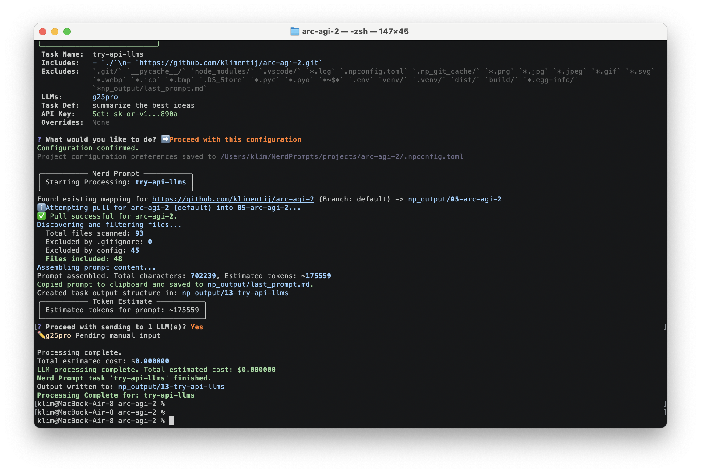

# NerdPrompt: Context Compiler for Long-Context LLMs

**Automated Context Assembly & LLM Interaction CLI**

`NerdPrompt` (np) is a Python command-line tool that automates the compilation of extensive context from multiple sources for use with long-context Large Language Models. It's designed to harness the power of modern LLMs that can handle massive context windows by intelligently gathering and organizing relevant information from:

1.  **Multiple Repositories:** Query across several Git repositories simultaneously.
2.  **Entire Project Codebases:** Include all relevant local project files at once.
3.  **Project Documentation:** Aggregate discussions, notes, and documentation for comprehensive brainstorming.
4.  **Mixed Sources:** Combine local files, remote repositories, and specific documents.

The tool automatically copies the assembled prompt to your clipboard, making it easy to paste into LLM interfaces like Google AI Studio, ChatGPT, Claude, or any other LLM UI of your choice, or to use with its built-in OpenRouter API integration.

**Screenshot of Interactive Mode:**


## Table of Contents

- [NerdPrompt: Context Compiler for Long-Context LLMs](#nerdprompt-context-compiler-for-long-context-llms)
  - [Table of Contents](#table-of-contents)
  - [Motivation](#motivation)
  - [Key Features](#key-features)
  - [Main Use Cases](#main-use-cases)
  - [Core Philosophy](#core-philosophy)
  - [Installation](#installation)
  - [Usage Guide](#usage-guide)
    - [Getting Started: Interactive Mode](#getting-started-interactive-mode)
    - [Interactive Setup Steps](#interactive-setup-steps)
    - [Non-Interactive Mode](#non-interactive-mode)
    - [Key CLI Options](#key-cli-options)
  - [Project Setup and Workflow](#project-setup-and-workflow)
    - [Running `np` in Your Project](#running-np-in-your-project)
    - [The `.npconfig.toml` File](#the-npconfigtoml-file)
    - [The `np_output/` Directory](#the-np_output-directory)
      - [Task Output Folders (`NNN-task-name/`)](#task-output-folders-nnn-task-name)
      - [Cloned Git Repositories (`NNN-repo-name/`)](#cloned-git-repositories-nnn-repo-name)
    - [The `np_output/last_prompt.md` File](#the-np_outputlast_promptmd-file)
  - [Configuration](#configuration)
    - [Project Configuration (`.npconfig.toml`)](#project-configuration-npconfigtoml)
    - [Global Configuration (OpenRouter API Key)](#global-configuration-openrouter-api-key)
  - [Key Functionality Details](#key-functionality-details)
    - [Git Repository Handling](#git-repository-handling)
    - [Clipboard Integration](#clipboard-integration)
    - [Token Estimation](#token-estimation)
  - [License](#license)

## Motivation

NerdPrompt was born out of frustration with manually assembling context for complex projects every single time. When working on sophisticated coding tasks or documentation generation, I found myself constantly copy-pasting files, notes, discussions, and email threads - wanting LLMs to have the complete picture to provide truly valuable answers.

The breaking point came when I needed to use entire repositories or multiple repos as context for complex tasks. Manually gathering all this information was tedious, error-prone, and time-consuming. I wanted a **vendor-lock-free approach** that I could control completely, while ensuring my compiled contexts were stored locally in clean, organized folder structures that could easily be committed to GitHub for future reference.

For the most complex questions, I often need to consult multiple LLMs - sending the same comprehensive context to several models via OpenRouter API, pasting into various web interfaces like AI Studio, then comparing their responses or using them as intermediate steps for compiling final answers. I wanted a tool that would streamline this entire workflow, from context compilation to multi-LLM consultation, while keeping everything organized and reusable for future iterations.

NerdPrompt eliminates the manual drudgery and lets me focus on asking the right questions with the right context.

## Key Features

*   **Long-Context Optimization:** Designed specifically for LLMs with large context windows (100K+ tokens).
*   **Multi-Repository Context:** Query multiple Git repositories in a single prompt.
*   **Comprehensive File Inclusion:** Easily include entire project codebases with smart filtering (respects `.gitignore` and custom excludes).
*   **Automatic Prompt Copying:** The assembled prompt is automatically copied to your clipboard before sending to LLMs, for seamless use with any LLM UI or other applications.
*   **Flexible LLM Integration:**
    *   Directly interact with models via the OpenRouter API.
    *   Use manual placeholder names (e.g., `manual-claude`) to generate empty response files for pasting content from other UIs.
*   **Interactive & Non-Interactive Modes:** Guided setup for ease of use, and CLI arguments for scripting and power users.
*   **Stateful Project Configuration:** Remembers your source includes/excludes, LLM choices, and last task name in a local `.npconfig.toml` for faster subsequent runs.
*   **Reproducible Git Handling:** Clones/updates specified Git repositories into `np_output/` and tracks exact commit hashes for context consistency.
*   **Organized Output:** Saves task details, LLM responses, and cloned repositories in a structured `np_output/` directory.
*   **Cost and Token Tracking:** Provides estimated costs and token usage for OpenRouter API calls.

## Main Use Cases

*   **Cross-Repository Analysis:** Ask questions that span multiple codebases or projects.
*   **Comprehensive Code Review:** Include entire project context for thorough analysis.
*   **Architecture Planning:** Use all project discussions, documentation, and code for system design.
*   **Knowledge Synthesis:** Combine multiple sources of information for brainstorming and decision-making.
*   **Legacy Code Understanding:** Gather complete context from large, complex codebases.
*   **Documentation Generation:** Include all relevant code and notes for comprehensive documentation.

## Core Philosophy

*   **Maximum Context Utilization:** Leverage the full potential of long-context LLMs.
*   **Frictionless Workflow:** One command to gather context from multiple complex sources.
*   **Universal LLM Compatibility:** Works with any LLM interface through clipboard integration for prompts and OpenRouter for API access.
*   **Developer Experience:** Clear feedback (`rich` powered), cross-platform (macOS, Linux, Windows).
*   **Flexibility:** Mix local/Git sources, use OpenRouter models or manual placeholders.
*   **Reproducibility:** Tracks the exact state of all included sources, including Git commit hashes.

## Installation

Ensure you have Python >= 3.9, `pip`, and `git` installed and available in your system's PATH.

1.  **Create a virtual environment (recommended):**
    ```bash
    uv venv  # Using UV
    source .venv/bin/activate  # On Windows: .venv\Scripts\activate
    # Or using venv:
    # python -m venv .venv
    # source .venv/bin/activate
    ```

2.  **Install NerdPrompt:**
    ```bash
    # Install from PyPI (once published)
    # uv pip install nerd-prompt

    # Or, install directly from source for development:
    git clone https://github.com/klimentij/NerdPrompt.git # Replace with actual URL
    cd NerdPrompt
    uv pip install -e .
    ```

3.  **Install development dependencies (for testing):**
    ```bash
    uv pip install pytest pytest-mock pytest-cov pytest-asyncio pytest-timeout
    ```

## Usage Guide

`NerdPrompt` can be run interactively for a guided setup or non-interactively using command-line arguments.

### Getting Started: Interactive Mode

The easiest way to start is by navigating to your project's root directory in your terminal and running:

```bash
np
```

This launches a guided setup process using interactive prompts (`questionary`) to configure your task. If you run `np run` without any specific arguments, it will also default to interactive mode.

### Interactive Setup Steps

The interactive setup will guide you through:

1.  **Configure Sources:**
    *   Define **include patterns** (files, directories using globs, or Git repository URLs). Defaults to `./` (current project).
    *   Define **exclude patterns** (paths/globs to ignore). These are added to `.gitignore` patterns which are always respected.
    *   Your choices are saved to `.npconfig.toml` for future runs.

2.  **Select LLMs:**
    *   Enter a space-separated list of target LLM names.
    *   Names containing a `/` (e.g., `google/gemini-pro`, `anthropic/claude-3-sonnet`) are treated as OpenRouter models and will be processed automatically if an API key is configured.
    *   Other names (e.g., `manual-gpt4o`, `local-llama`) act as placeholders, creating empty files in the output for you to manually fill with responses.
    *   Saved to `.npconfig.toml`.

3.  **Name Your Task:**
    *   Provide a short, descriptive name for this specific run (e.g., "refactor-auth-module"). This name is used for the output folder.
    *   The last used task name is pre-filled if available.
    *   Saved to `.npconfig.toml`.

4.  **Define the Task:**
    *   Enter the main instructions or prompt for the LLM.
    *   You can type multiline text directly or, if it's the first run or you choose to, load it from a `.md` or `.txt` file.

5.  **Advanced Settings (Optional):**
    *   **OpenRouter API Key:** Manage your API key. If not set, you'll be prompted. The key is stored globally and securely.
    *   **Parameter Overrides:** Set model-specific parameters for OpenRouter calls (e.g., `temperature`, `max_tokens`). Saved to `.npconfig.toml`.

Once configured, NerdPrompt will:
*   Discover and filter files based on your include/exclude patterns and `.gitignore`.
*   Process any specified Git repositories.
*   Assemble the complete prompt.
*   **Copy the assembled prompt to your clipboard.**
*   Save the prompt to `np_output/last_prompt.md`.
*   Create a numbered output folder for the task (e.g., `np_output/001-refactor-auth-module/`).
*   Save task details to `_task.md` within the task folder.
*   Send requests to OpenRouter models (if any) and save their responses.
*   Create empty placeholder files for manual LLM inputs.

**Screenshot of Task Execution:**


### Non-Interactive Mode

For scripting or direct command execution, use the `run` command with options:

```bash
np run [OPTIONS]
```

### Key CLI Options

Run `np run --help` for a full list of options.

*   `--name TEXT` / `-n TEXT`: **Required.** Short name for the task (e.g., "refactor-auth").
*   `--task TEXT` / `-t TEXT`: Task definition text.
*   `--task-file FILE` / `-f FILE`: Path to a file containing the task definition.
    *   One of `--task` or `--task-file` is **required**.
*   `--include TEXT ...` / `-i TEXT ...`: Path/glob/URL to include. Can be repeated. Overwrites includes from `.npconfig.toml`.
*   `--exclude TEXT ...` / `-e TEXT ...`: Path/glob to exclude. Can be repeated. Adds to excludes from `.npconfig.toml` and `.gitignore`.
*   `--llm TEXT ...` / `-l TEXT ...`: Target LLM names (OpenRouter format or manual placeholder). Can be repeated. Overwrites LLMs from `.npconfig.toml`.
*   `--param MODEL KEY VALUE ...` / `-p MODEL KEY VALUE ...`: Override OpenRouter parameters for a specific model. Can be repeated. (e.g., `-p google/gemini-pro temperature 0.8`).
*   `--set-api-key`: Force prompt to enter/update the global OpenRouter API key, even if one is already set.
*   `-y`, `--yes`: Skip the final confirmation prompt before processing.

**Example Non-Interactive Run:**

```bash
np run \
    --name "analyze-core-logic" \
    --task-file ./prompts/analysis_prompt.md \
    --include ./src/core/ \
    --include 'https://github.com/org/shared-library.git#main' \
    --exclude "*.log" \
    --exclude "**/__pycache__/" \
    --llm "anthropic/claude-3-opus-20240229" \
    --llm "manual-review-notes" \
    --param "anthropic/claude-3-opus-20240229" max_tokens_to_sample 4000 \
    -y
```

## Project Setup and Workflow

### Running `np` in Your Project

It's recommended to run `np` from the root directory of your project. This allows NerdPrompt to correctly:
*   Resolve relative paths for include/exclude patterns.
*   Find your project's `.gitignore` file.
*   Create and manage the `.npconfig.toml` file and the `np_output/` directory within your project.

### The `.npconfig.toml` File

When you run `np` interactively, it saves your preferences to a `.npconfig.toml` file in your project's root directory. This file stores:
*   `default_includes`: List of default include patterns.
*   `default_excludes`: List of default exclude patterns.
*   `default_llms`: List of default LLM names.
*   `last_task_name`: The name of the last task you ran, pre-filled for convenience.
*   `default_model_overrides`: Default parameter overrides for specific OpenRouter models.
*   `copy_to_clipboard`: (Default: true) Controls clipboard operations (currently, prompt copying is always active).
*   `git_repo_map`: An internal mapping of Git repository URLs (and branches) to their numbered folders within `np_output/`. **Do not edit `git_repo_map` manually.**

You can commit `.npconfig.toml` to your repository if you want to share default settings with collaborators, but ensure it doesn't contain sensitive information if your exclude patterns are very broad.

### The `np_output/` Directory

NerdPrompt organizes all its outputs within an `np_output/` directory created at your project root. This directory has a consistent, numbered structure:

```
your-project/
├── np_output/
│   ├── 001-some-cloned-repo/      # Cloned/updated Git repo (if specified in includes)
│   │   └── ... (repo content)
│   ├── 002-initial-setup-task/    # Output for a task run
│   │   ├── _task.md               # Task definition, included sources, metadata
│   │   ├── google-gemini-pro.md   # LLM response (or error message)
│   │   └── manual-gpt4-notes.md   # Empty placeholder for manual input, or filled if you edit it
│   ├── 003-another-cloned-repo/   # Another cloned/updated Git repo
│   │   └── ... (repo content)
│   └── 004-refactor-feature-xyz/  # Output for another task run
│       ├── _task.md
│       └── ... (response files for LLMs specified for this task)
│   └── last_prompt.md             # The most recently assembled and copied prompt
│
├── 01-initial-discussion/
```

*   **Folder Numbering:** Both task output folders and newly cloned Git repository folders are numbered sequentially (e.g., `001-`, `002-`) based on their creation order. NerdPrompt automatically renumbers and re-pads existing folders if needed to maintain consistency (e.g., `01-` might become `001-` if a `100th` item is created).
*   **Git Cache:** Cloned repositories are stored in `np_output/NNN-repo-name/`. These are effectively a local cache. On subsequent runs, `np` will attempt to `git pull` updates in these existing folders.

#### Task Output Folders (`NNN-task-name/`)

For each run of `np`, a new numbered folder is created, e.g., `np_output/002-initial-setup-task/`. It contains:

*   **`_task.md`:** A detailed record of the task run, including:
    *   The original task name.
    *   The full task definition/prompt instructions provided by you.
    *   A list of all included context sources (local files, directories, and Git repositories with their specific commit hashes and local paths within `np_output/`).
    *   Timestamp of creation.
    *   Estimated token count for the assembled prompt.
    *   List of LLMs targeted for this task.
*   **`model-name.md`:** For each LLM specified for the task (e.g., `google-gemini-pro.md`, `manual-gpt4-notes.md`):
    *   If it's an OpenRouter model, this file will contain the response from the LLM, along with metadata like token usage and cost. If an error occurred, error details are saved here.
    *   If it's a manual placeholder, this file is initially empty, allowing you to paste responses from other UIs.

#### Cloned Git Repositories (`NNN-repo-name/`)

When you include a Git repository URL as a source, `np` clones it into a numbered folder within `np_output/`, like `np_output/001-some-cloned-repo/`. Files from this local clone are then included in the context assembly. See [Git Repository Handling](#git-repository-handling) for more details.

### The `np_output/last_prompt.md` File

After assembling the full prompt from all sources and your task definition, NerdPrompt saves this complete prompt to `np_output/last_prompt.md`. This file is overwritten on each run with the latest assembled prompt.

## Configuration

### Project Configuration (`.npconfig.toml`)

As mentioned, this file is created in your project root and stores defaults for includes, excludes, LLMs, model parameter overrides, and the last task name. It's managed automatically by the interactive mode.

### Global Configuration (OpenRouter API Key)

Your OpenRouter API key is stored securely in a global configuration file specific to your user account (location determined by `appdirs`, e.g., `~/.config/nerd-prompt/settings.toml` on Linux, or similar paths on macOS/Windows).

*   **Set the Key:**
    The recommended way to set your API key is using the dedicated command:
    ```bash
    np set-key
    ```
    You will be prompted to enter your key. It will be validated (must start with `sk-or-`) and saved globally.
    You can also set or update the key via the "Advanced Settings" in interactive mode (`np`), or by using the `--set-api-key` flag with the `np run` command (though `np set-key` is preferred for initial setup).

*   **Environment Variable:**
    Alternatively, you can set the `OPENROUTER_API_KEY` environment variable. This will take precedence over the key stored in the global configuration file.

*   **Debug API Key Setup:**
    If you encounter issues with your API key or want to see how `np` is attempting to load it, use:
    ```bash
    np debug-api
    ```
    This command provides detailed diagnostics about your API key's source (environment variable, global config file), its status, and paths.

## Key Functionality Details

### Git Repository Handling

When you include a Git repository URL as a source (e.g., `https://github.com/user/repo.git` or `https://github.com/user/repo.git#branch-name`):

1.  **Mapping & Caching:** `np` checks `.npconfig.toml` for an existing mapping of this URL+branch to a numbered folder in `np_output/`.
2.  **New Repo:** If not mapped, it gets the next available sequential number (e.g., `003-`), creates a folder like `np_output/003-repo-name/`, clones the repository (`git clone --depth 1`, optionally with `-b branch-name`) into it, and saves this mapping to `.npconfig.toml`.
3.  **Existing Repo:** If a mapping exists, `np` navigates to the corresponding folder (e.g., `np_output/003-repo-name/`) and attempts a `git checkout <branch>` followed by `git pull` to fetch updates.
4.  **Fallback:** If a `pull` fails on an existing mapped directory (e.g., if the `.git` folder is corrupted or the directory was manually altered), `np` may attempt a fresh `clone` into the correct numbered directory after cleaning it.
5.  **Commit Tracking:** After a successful clone or pull, the exact commit hash (`git rev-parse HEAD`) of the repository's state is recorded.
6.  **Context Inclusion:** Files within the successfully cloned/updated numbered Git repository folder are then scanned (respecting that repository's `.gitignore`, plus your project's global `.gitignore` and `np` exclude patterns) and included in the prompt assembly for the *current task*.
7.  **`_task.md` Record:** The `_task.md` file generated for your task clearly lists which Git repos were used, the branch requested, the *exact commit hash* that was processed, and the path to the numbered folder where it resides within `np_output/`.

This system ensures that your context from Git repositories is reproducible and up-to-date.

### Clipboard Integration

NerdPrompt enhances your workflow with built-in clipboard functionality:

*   **Automatic Prompt Copying:** Immediately after the full context prompt is assembled (combining all file contents and your task instructions), and *before* it's sent to any LLM APIs, the entire prompt is automatically copied to your system clipboard.
    *   This allows you to quickly paste the comprehensive prompt into other applications, such as a different LLM web UI, a text editor for review, or a note-taking app, even while NerdPrompt might be waiting for API responses.
    *   A console message will confirm that the prompt has been copied.
*   This functionality uses the `pyperclip` library and includes error handling for potential clipboard access issues. If copying fails, a warning is displayed, but the program continues.

*(Note: Based on the provided codebase, only prompt copying is implemented. The rules files mention response copying as well, which might be a planned feature or a discrepancy.)*

### Token Estimation

Token counts for the assembled prompt are *estimated* based on the total character count using an approximate ratio (default: 4.0 characters per token). This method is fast but not perfectly accurate, as different models have different tokenization schemes. The estimate is displayed in the console during processing and recorded in the `_task.md` file for your reference. For OpenRouter API calls, the actual token counts (prompt, completion, total) and cost are retrieved from the API response and included in the LLM's output file.

## License

MIT License